## 表格
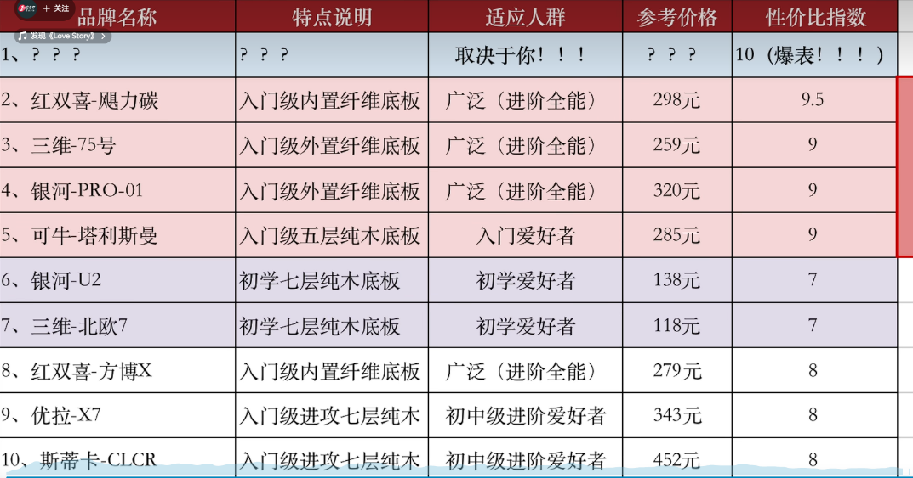

## 三维北欧
- 北欧7 7x 8g 6mm ￥85
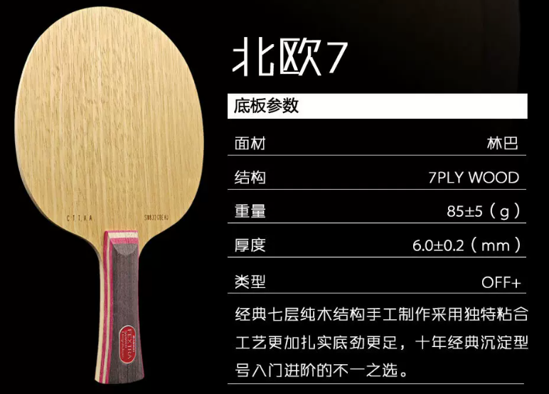
- 银河U2 7x 85g 6mm ￥95
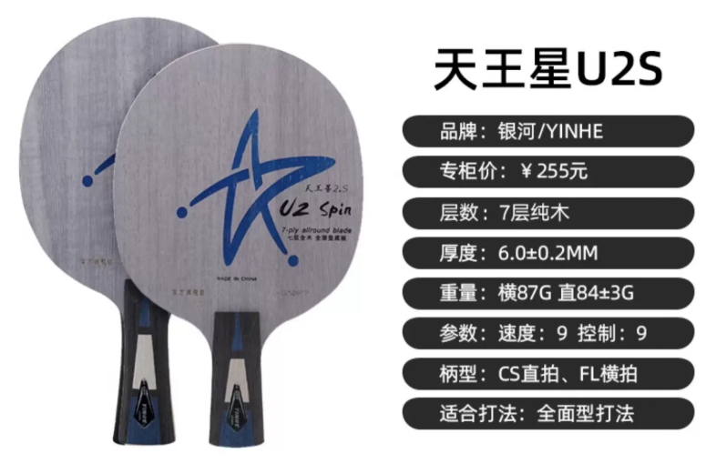

## 可牛
- 可牛-塔利斯曼 ￥260
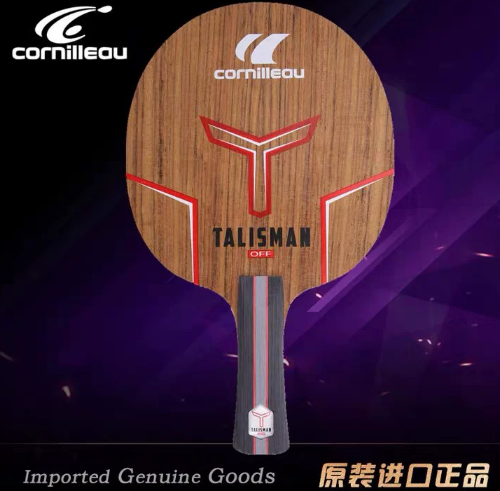

## 银河
- 银河Pro-05 7x+C 85g 5.6mm ￥215*
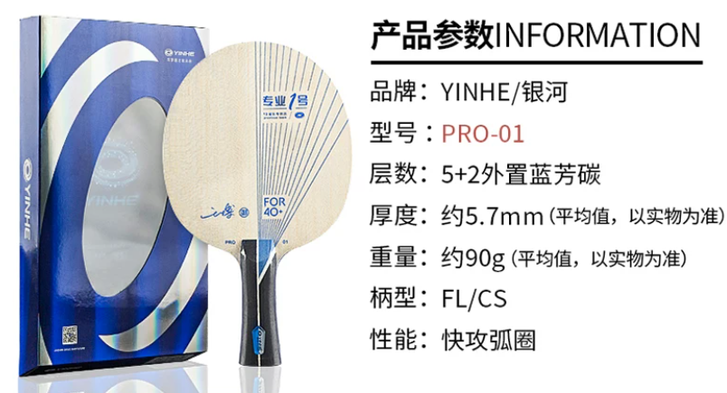
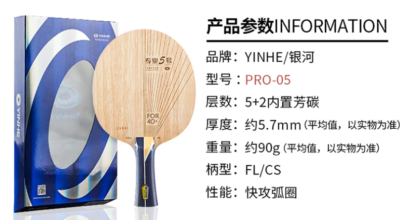
- 银河D-607 7x 90g 6.3mm ￥240 x
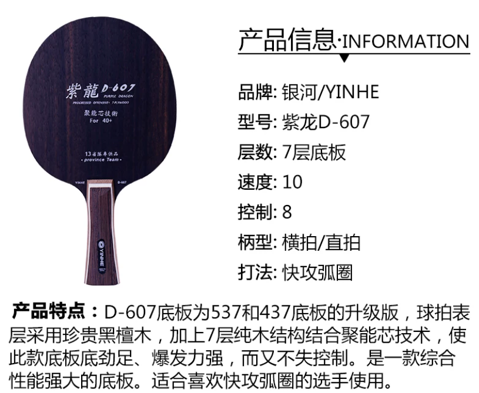
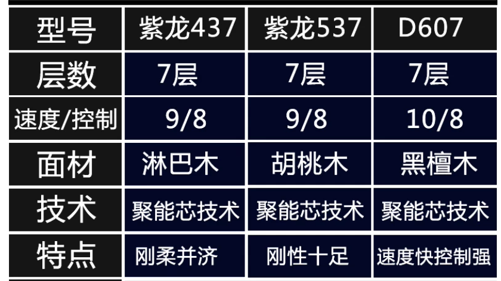

## CLCR
- CLCR ￥340
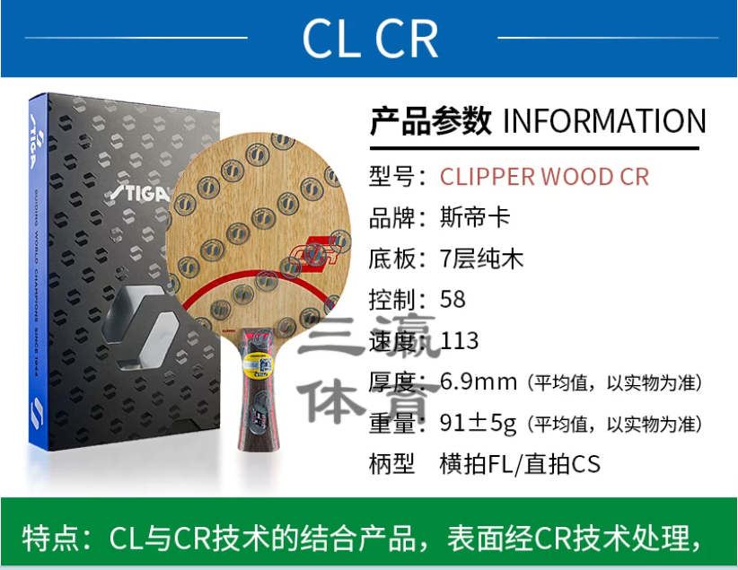

## 樊振东ALC
- 樊振东ALC ￥800-1000
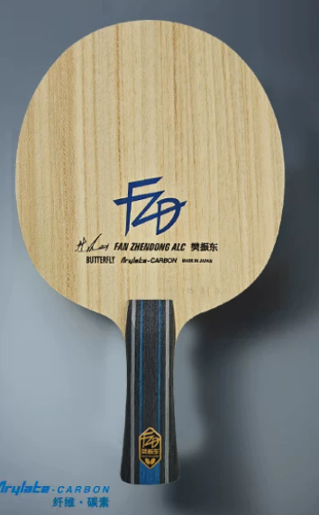

## 红双喜
- 红双喜劲极黑檀7S 7x 90g 6.3mm *￥200
- 红双喜劲极7S 7x 96g 6.3mm *￥200
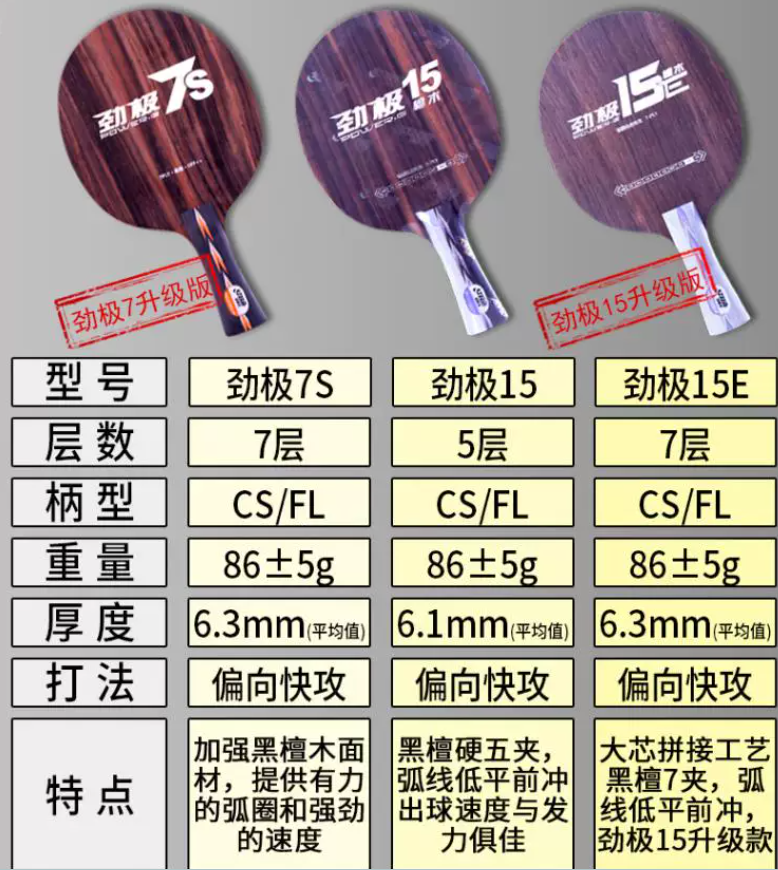
- 红双喜博芳碳X 7x+C 88g 6.3mm *￥221
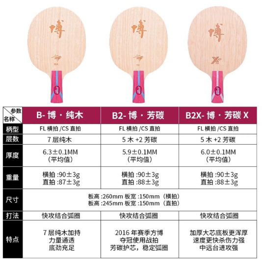
- 飓力碳 98.2g 6.23mm
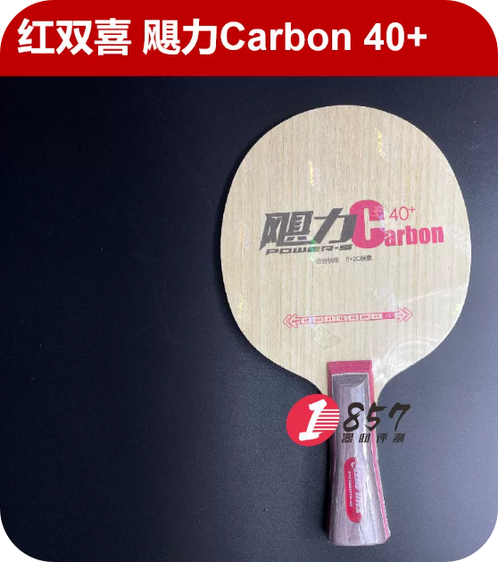

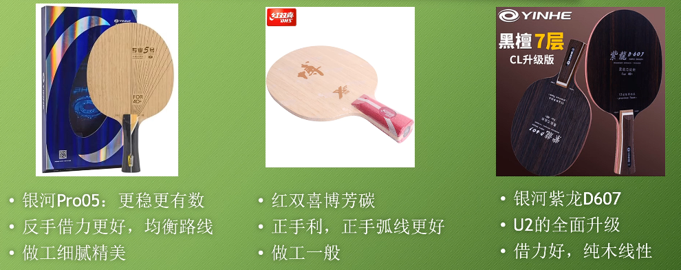

- 银河Pro-05 银河紫龙D-607 红双喜劲极黑檀7S 红双喜博芳碳X

## 银河Pro-05 ✅️

| 部件 | 型号         | 规格            |
|:------|--------------|---------------|
| 底板 | 银河 Pro-05  | 横拍 FL柄                    |
| 正手 | 银河北斗2    | 橙海绵 / 39度 / 2.1mm        |
| 反手 | 银河月球12   | 中软硬度 / MAX厚度           |